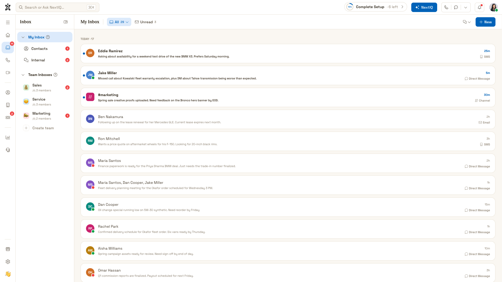

# Inbox2 Page Documentation

**Generated:** 2026-03-13T18:46:21.201Z
**URL:** https://ui-options-nexus-design-two.vercel.app/inbox2

## 1. Overall Layout

**Page Title:** NEXT 2.0 🚀
**Viewport:** 1920x1080
**Background Color:** rgb(250, 247, 242)
**Font Family:** "Space Grotesk", system-ui, sans-serif

## 6. Styling & Design

**Typography:**
- Font Family: "Space Grotesk", system-ui, sans-serif
- Font Size: 16px
- Line Height: 24px

**Color Scheme:**
- Primary Background: rgb(250, 247, 242)
- Primary Text: rgb(44, 36, 23)

**Button Styling:**
- Background: rgba(0, 0, 0, 0)
- Color: rgb(74, 63, 48)
- Border Radius: 12px

## Screenshots

- [Full Page Screenshot](00-fullpage.png)
- [Overall Layout](01-overall-layout.png)
- [Left Sidebar](02-left-sidebar.png)
